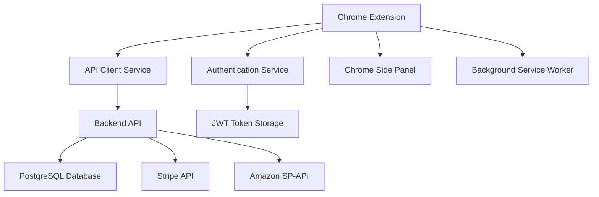

# FastChecker Architecture Documentation

## 🏗️ System Architecture Overview

FastChecker follows a client-server architecture with a Chrome extension frontend and a REST API backend.

## 🎯 High-Level Architecture



## 📱 Frontend Architecture (Chrome Extension)

### Core Components
```
Chrome Extension Frontend
├── Manifest v3 Configuration
├── Background Service Worker
├── Side Panel Interface
├── Authentication Management
├── API Communication Layer
└── Translation System
```

### Component Hierarchy
```
FastChecker Class (Main Controller)
├── Authentication Management
│   ├── Login/Register Forms
│   ├── JWT Token Handling
│   └── User Session Management
├── Navigation System
│   ├── Tab Management
│   ├── Route Handling
│   └── UI State Management
├── ASIN Checking Interface
│   ├── Input Validation
│   ├── API Communication
│   └── Results Display
├── Settings Management
│   ├── SP-API Configuration
│   ├── Language Selection
│   └── Theme Management
├── Subscription Management
│   ├── Plan Display
│   ├── Usage Tracking
│   └── Stripe Integration
└── Translation System
    ├── Language Detection
    ├── Text Replacement
    └── Dynamic Updates
```

### Data Flow
1. **User Input** → FastChecker Class
2. **FastChecker Class** → Service Layer (AuthService/APIClient)
3. **Service Layer** → Backend API
4. **Backend Response** → Service Layer
5. **Service Layer** → UI Update

## 🖥️ Backend Architecture (Node.js)

### Layered Architecture
```
Backend API Architecture
├── Presentation Layer (Routes)
├── Business Logic Layer (Controllers)
├── Data Access Layer (Database)
├── External Services Layer (SP-API, Stripe)
└── Infrastructure Layer (Middleware, Config)
```

### Component Structure
```
Backend Components
├── Express Server (server.js)
├── Route Handlers
│   ├── Authentication Routes (/api/auth)
│   ├── ASIN Check Routes (/api/check)
│   ├── Subscription Routes (/api/subscription)
│   └── Settings Routes (/api/settings)
├── Controllers
│   ├── authController.js
│   ├── asinController.js
│   ├── subscriptionController.js
│   └── settingsController.js
├── Middleware
│   ├── Authentication (JWT)
│   ├── Rate Limiting
│   ├── CORS Configuration
│   └── Error Handling
├── Database Layer
│   ├── Connection Pool
│   ├── Query Optimization
│   └── Transaction Management
└── External Integrations
    ├── Amazon SP-API Client
    ├── Stripe Payment Processing
    └── Email Services (Future)
```

## 🗄️ Database Architecture

### Entity Relationship
```
PostgreSQL Database Schema
├── users (Core user data)
├── user_settings (SP-API configurations)
├── asin_history (Search history)
├── subscriptions (Stripe subscriptions)
└── usage_tracking (Usage analytics)
```

### Relationships
- **users** (1:1) → **user_settings**
- **users** (1:n) → **asin_history** 
- **users** (1:1) → **subscriptions**
- **users** (1:n) → **usage_tracking**

## 🔐 Security Architecture

### Authentication Flow
```
Authentication Security Layer
├── Frontend JWT Storage (Chrome Storage API)
├── HTTP-Only Cookie Alternative (Chrome Extension)
├── Token Refresh Mechanism
├── Automatic Logout on Expiry
└── Secure API Communication (HTTPS)
```

### Backend Security
```
Backend Security Measures
├── JWT Token Validation
├── bcrypt Password Hashing (Salt Rounds: 12)
├── Rate Limiting (Express Rate Limit)
├── CORS Configuration
├── Helmet Security Headers
├── Input Validation (Joi)
├── XSS Protection
└── SQL Injection Prevention (Parameterized Queries)
```

## 🔄 Communication Architecture

### API Communication Flow
1. **Chrome Extension** → HTTPS Request → **Railway Backend**
2. **Backend** → JWT Validation → **Request Processing**
3. **Backend** → Database Query → **Data Retrieval**
4. **Backend** → External API (SP-API/Stripe) → **Service Integration**
5. **Backend** → Response Formation → **Chrome Extension**

### Error Handling Architecture
```
Error Handling Strategy
├── Frontend Error Boundary
│   ├── Try-Catch Blocks
│   ├── Toast Notifications
│   └── Fallback UI States
├── Backend Error Middleware
│   ├── Validation Errors
│   ├── Database Errors
│   ├── External API Errors
│   └── Generic Error Handler
└── User-Friendly Messages
    ├── Translated Error Messages
    ├── Action Suggestions
    └── Recovery Options
```

## 🌐 External Service Integration

### Amazon SP-API Integration
```
SP-API Integration Architecture
├── Credentials Management (User Settings)
├── Token Refresh Automation
├── API Rate Limiting Respect
├── Error Handling & Retries
├── Response Caching Strategy
└── Multi-Region Support (US, EU, FE)
```

### Stripe Payment Integration
```
Stripe Integration Architecture
├── Secure API Key Management
├── Webhook Event Handling
├── Subscription Lifecycle Management
├── Payment Method Management
├── Invoice Generation
└── Usage-Based Billing
```

## 📊 Performance Architecture

### Frontend Performance
- **Lazy Loading**: Components loaded on demand
- **Debounced Inputs**: Search optimization
- **Minimal DOM**: Efficient UI updates
- **CSS Optimization**: Custom properties for theming
- **Memory Management**: Proper event listener cleanup

### Backend Performance
- **Connection Pooling**: PostgreSQL connection optimization
- **Query Optimization**: Indexed database queries
- **Caching Strategy**: Redis for session management (Future)
- **Rate Limiting**: API protection
- **Compression**: gzip response compression

## 🔧 Development Architecture

### Build & Deployment Pipeline
```
Development Workflow
├── Local Development Environment
│   ├── Chrome Extension (Unpacked)
│   ├── Local Backend Server
│   └── Local PostgreSQL Database
├── Testing Environment
│   ├── Unit Tests (Future)
│   ├── Integration Tests (Future)
│   └── Manual Testing Protocol
└── Production Environment
    ├── Railway Backend Deployment
    ├── PostgreSQL Production Database
    └── Chrome Web Store Distribution
```

### Configuration Management
```
Environment Configuration
├── Development (.env.local)
│   ├── Local Database URLs
│   ├── Test Stripe Keys
│   └── Development JWT Secrets
├── Production (Railway Environment)
│   ├── Production Database URLs
│   ├── Live Stripe Keys
│   └── Secure JWT Secrets
└── Extension Configuration
    ├── Manifest.json Environment Switching
    ├── API URL Configuration
    └── Feature Flag Management
```

## 🔍 Monitoring & Observability

### Logging Architecture
```
Logging Strategy
├── Frontend Logging
│   ├── Console Logging (Development)
│   ├── Error Tracking
│   └── User Action Analytics
├── Backend Logging (Winston)
│   ├── HTTP Request Logging
│   ├── Database Query Logging
│   ├── Error Logging
│   └── Performance Metrics
└── External Service Monitoring
    ├── SP-API Rate Limiting
    ├── Stripe Webhook Status
    └── Database Performance
```

### Health Monitoring
- **Backend Health Endpoints**: `/health`, `/api/health`
- **Database Connection Monitoring**: Connection pool status
- **External Service Status**: SP-API and Stripe connectivity
- **Error Rate Monitoring**: Critical error tracking

## 🚀 Scalability Architecture

### Horizontal Scaling Considerations
- **Stateless Backend Design**: JWT-based authentication
- **Database Connection Pooling**: Optimized for concurrent users
- **CDN Integration**: Static asset delivery (Future)
- **Load Balancer Ready**: Railway scaling capabilities
- **Microservice Migration Path**: Planned service separation

### Vertical Scaling Options
- **Railway Resource Scaling**: CPU and memory upgrades
- **Database Scaling**: PostgreSQL performance tuning
- **Connection Pool Optimization**: Maximum connections tuning
- **Query Optimization**: Index management and query analysis

---

**Architecture Version**: 2.0  
**Last Updated**: 2025-01-15  
**Next Review**: 2025-02-15