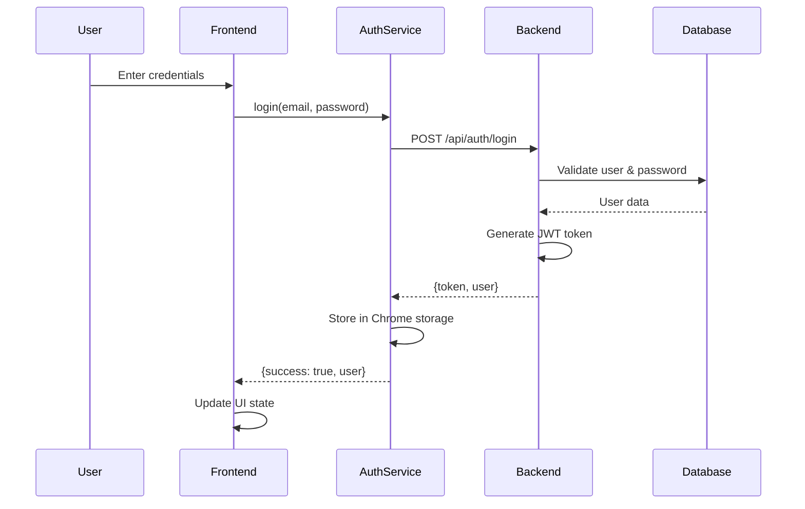

# FastChecker Authentication System Documentation

## 🔐 Authentication Overview

FastChecker implements a secure JWT-based authentication system with bcrypt password hashing, session management, and comprehensive security features. The system supports user registration, login, profile management, and automatic token refresh.

## 🏗️ Authentication Architecture

### System Components
```
Authentication System
├── Frontend Authentication (Chrome Extension)
│   ├── AuthService Class
│   ├── JWT Token Management
│   ├── Chrome Storage Integration
│   └── UI Authentication Flow
├── Backend Authentication (Node.js)
│   ├── JWT Generation & Validation
│   ├── bcrypt Password Hashing
│   ├── Session Management
│   └── Security Middleware
└── Security Features
    ├── Rate Limiting
    ├── Input Validation
    ├── CORS Protection
    └── XSS Prevention
```

### Authentication Flow


## 🖥️ Frontend Authentication Service

### 1. AuthService Class Structure
```javascript
// services/authService.js
class AuthService {
    constructor() {
        this.baseURL = 'https://professionalfastchecker-production.up.railway.app';
        this.token = null;
        this.user = null;
    }
    
    // Core authentication methods
    async login(email, password) { /* ... */ }
    async register(email, password) { /* ... */ }
    async logout() { /* ... */ }
    async refreshToken() { /* ... */ }
    async isAuthenticated() { /* ... */ }
    
    // Token management
    async getToken() { /* ... */ }
    async getCurrentUser() { /* ... */ }
    
    // API communication
    async makeAuthenticatedRequest(url, options) { /* ... */ }
}
```

### 2. Login Implementation
```javascript
async login(email, password) {
    try {
        const response = await fetch(`${this.baseURL}/api/auth/login`, {
            method: 'POST',
            headers: {
                'Content-Type': 'application/json',
            },
            body: JSON.stringify({ email, password })
        });

        const data = await response.json();

        if (!response.ok) {
            throw new Error(data.error || 'Login failed');
        }

        // Store authentication data
        this.token = data.token;
        this.user = data.user;

        // Persist in Chrome storage
        await chrome.storage.local.set({
            authToken: this.token,
            currentUser: this.user
        });

        return { success: true, user: this.user };

    } catch (error) {
        console.error('Login error:', error);
        return { success: false, error: error.message };
    }
}
```

### 3. Registration Implementation
```javascript
async register(email, password) {
    try {
        const response = await fetch(`${this.baseURL}/api/auth/register`, {
            method: 'POST',
            headers: {
                'Content-Type': 'application/json',
            },
            body: JSON.stringify({ email, password })
        });

        const data = await response.json();

        if (!response.ok) {
            throw new Error(data.error || 'Registration failed');
        }

        // Auto-login after registration
        this.token = data.token;
        this.user = data.user;

        await chrome.storage.local.set({
            authToken: this.token,
            currentUser: this.user
        });

        return { success: true, user: this.user };

    } catch (error) {
        console.error('Registration error:', error);
        return { success: false, error: error.message };
    }
}
```

### 4. Token Management
```javascript
// Get stored token
async getToken() {
    if (this.token) return this.token;

    const stored = await chrome.storage.local.get('authToken');
    if (stored.authToken) {
        this.token = stored.authToken;
        return this.token;
    }

    return null;
}

// Validate token locally
async isAuthenticated() {
    const token = await this.getToken();
    if (!token) return false;

    try {
        // Decode JWT payload to check expiration
        const payload = JSON.parse(atob(token.split('.')[1]));
        const now = Date.now() / 1000;
        
        if (payload.exp < now) {
            // Token expired, clear it
            await this.logout();
            return false;
        }
        return true;
    } catch (error) {
        console.error('Token validation error:', error);
        await this.logout();
        return false;
    }
}

// Refresh user profile data
async refreshToken() {
    try {
        const token = await this.getToken();
        if (!token) throw new Error('No token available');

        const response = await fetch(`${this.baseURL}/api/auth/profile`, {
            method: 'GET',
            headers: {
                'Authorization': `Bearer ${token}`,
                'Content-Type': 'application/json'
            }
        });

        if (!response.ok) {
            throw new Error('Token refresh failed');
        }

        const data = await response.json();
        this.user = data.user;
        await chrome.storage.local.set({ currentUser: this.user });

        return this.token;

    } catch (error) {
        console.error('Token refresh error:', error);
        await this.logout();
        throw error;
    }
}
```

### 5. Authenticated API Requests
```javascript
async makeAuthenticatedRequest(url, options = {}) {
    const token = await this.getToken();
    if (!token) {
        throw new Error('Not authenticated');
    }

    const authOptions = {
        ...options,
        headers: {
            'Authorization': `Bearer ${token}`,
            'Content-Type': 'application/json',
            ...options.headers
        }
    };

    try {
        let response = await fetch(url, authOptions);

        // Handle token expiration
        if (response.status === 401) {
            await this.refreshToken();
            const newToken = await this.getToken();
            
            authOptions.headers.Authorization = `Bearer ${newToken}`;
            response = await fetch(url, authOptions);
        }

        return response;

    } catch (error) {
        console.error('Authenticated request error:', error);
        throw error;
    }
}
```

### 6. Logout Implementation
```javascript
async logout() {
    this.token = null;
    this.user = null;

    // Clear all stored authentication data
    await chrome.storage.local.remove([
        'authToken', 
        'currentUser', 
        'apiSettings'
    ]);

    return { success: true };
}
```

## 🖥️ Backend Authentication System

### 1. Authentication Controller
```javascript
// controllers/authController.js
const bcrypt = require('bcrypt');
const jwt = require('jsonwebtoken');
const pool = require('../config/database');

const register = async (req, res) => {
    try {
        const { email, password } = req.body;
        
        // Input validation
        if (!email || !password) {
            return res.status(400).json({ error: 'Email and password required' });
        }
        
        if (password.length < 8) {
            return res.status(400).json({ error: 'Password must be at least 8 characters' });
        }
        
        // Email format validation
        const emailRegex = /^[^\s@]+@[^\s@]+\.[^\s@]+$/;
        if (!emailRegex.test(email)) {
            return res.status(400).json({ error: 'Invalid email format' });
        }
        
        // Check if user exists
        const existingUser = await pool.query(
            'SELECT id FROM users WHERE email = $1', [email]
        );
        
        if (existingUser.rows.length > 0) {
            return res.status(409).json({ error: 'User already exists' });
        }
        
        // Hash password with salt rounds 12
        const passwordHash = await bcrypt.hash(password, 12);
        
        // Create user with transaction
        const client = await pool.connect();
        try {
            await client.query('BEGIN');
            
            // Insert user
            const result = await client.query(
                `INSERT INTO users (email, password_hash, subscription_plan, monthly_usage_count, is_active) 
                 VALUES ($1, $2, 'FREE', 0, true) 
                 RETURNING id, email, subscription_plan, monthly_usage_count, created_at`,
                [email, passwordHash]
            );
            
            const user = result.rows[0];
            
            // Create default settings
            await client.query(
                `INSERT INTO user_settings (user_id, refresh_token, client_id, client_secret, seller_id, marketplace) 
                 VALUES ($1, '', '', '', '', 'ATVPDKIKX0DER')`,
                [user.id]
            );
            
            // Set usage reset date to next month
            const nextMonth = new Date();
            nextMonth.setMonth(nextMonth.getMonth() + 1, 1);
            nextMonth.setHours(0, 0, 0, 0);
            
            await client.query(
                'UPDATE users SET usage_reset_date = $1 WHERE id = $2',
                [nextMonth, user.id]
            );
            
            await client.query('COMMIT');
            
            // Generate JWT
            const token = jwt.sign(
                { 
                    userId: user.id, 
                    email: user.email,
                    iat: Math.floor(Date.now() / 1000)
                },
                process.env.JWT_SECRET,
                { expiresIn: process.env.JWT_EXPIRES_IN || '7d' }
            );
            
            res.status(201).json({
                message: 'User created successfully',
                token,
                user: {
                    id: user.id,
                    email: user.email,
                    subscriptionPlan: user.subscription_plan,
                    monthlyUsageCount: user.monthly_usage_count,
                    createdAt: user.created_at
                }
            });
            
        } catch (dbError) {
            await client.query('ROLLBACK');
            throw dbError;
        } finally {
            client.release();
        }
        
    } catch (error) {
        console.error('Registration error:', error);
        res.status(500).json({ error: 'Internal server error' });
    }
};
```

### 2. Login Controller
```javascript
const login = async (req, res) => {
    try {
        const { email, password } = req.body;
        
        // Input validation
        if (!email || !password) {
            return res.status(400).json({ error: 'Email and password required' });
        }
        
        // Get user with password hash
        const result = await pool.query(
            `SELECT id, email, password_hash, subscription_plan, monthly_usage_count, 
                    usage_reset_date, is_active, created_at, last_login 
             FROM users WHERE email = $1`,
            [email]
        );
        
        if (result.rows.length === 0) {
            return res.status(401).json({ error: 'Invalid credentials' });
        }
        
        const user = result.rows[0];
        
        // Check if account is active
        if (!user.is_active) {
            return res.status(401).json({ error: 'Account deactivated' });
        }
        
        // Verify password
        const validPassword = await bcrypt.compare(password, user.password_hash);
        if (!validPassword) {
            // Log failed login attempt
            await pool.query(
                'INSERT INTO failed_login_attempts (email, ip_address, attempt_time) VALUES ($1, $2, $3)',
                [email, req.ip, new Date()]
            );
            
            return res.status(401).json({ error: 'Invalid credentials' });
        }
        
        // Check if monthly usage should reset
        const now = new Date();
        const resetDate = new Date(user.usage_reset_date);
        
        if (now > resetDate) {
            // Reset monthly usage
            const nextMonth = new Date(now.getFullYear(), now.getMonth() + 1, 1);
            await pool.query(
                'UPDATE users SET monthly_usage_count = 0, usage_reset_date = $1 WHERE id = $2',
                [nextMonth, user.id]
            );
            user.monthly_usage_count = 0;
        }
        
        // Generate JWT
        const token = jwt.sign(
            { 
                userId: user.id, 
                email: user.email,
                iat: Math.floor(Date.now() / 1000)
            },
            process.env.JWT_SECRET,
            { expiresIn: process.env.JWT_EXPIRES_IN || '7d' }
        );
        
        // Update last login
        await pool.query(
            'UPDATE users SET last_login = $1 WHERE id = $2',
            [now, user.id]
        );
        
        // Log successful login
        await pool.query(
            'INSERT INTO login_history (user_id, ip_address, user_agent, login_time) VALUES ($1, $2, $3, $4)',
            [user.id, req.ip, req.get('User-Agent'), now]
        );
        
        res.json({
            message: 'Login successful',
            token,
            user: {
                id: user.id,
                email: user.email,
                subscriptionPlan: user.subscription_plan.toUpperCase(),
                monthlyUsageCount: user.monthly_usage_count,
                usageResetDate: user.usage_reset_date,
                createdAt: user.created_at,
                lastLogin: now
            }
        });
        
    } catch (error) {
        console.error('Login error:', error);
        res.status(500).json({ error: 'Internal server error' });
    }
};
```

### 3. Profile Controller
```javascript
const getProfile = async (req, res) => {
    try {
        const userId = req.user.userId;
        
        const result = await pool.query(
            `SELECT id, email, subscription_plan, monthly_usage_count, usage_reset_date, 
                    created_at, last_login, is_active
             FROM users WHERE id = $1`,
            [userId]
        );
        
        if (result.rows.length === 0) {
            return res.status(404).json({ error: 'User not found' });
        }
        
        const user = result.rows[0];
        
        // Get subscription details
        const subscriptionResult = await pool.query(
            `SELECT plan_code, status, created_at as subscription_date
             FROM subscription_history 
             WHERE user_id = $1 AND status = 'active' 
             ORDER BY created_at DESC LIMIT 1`,
            [userId]
        );
        
        let subscriptionDetails = null;
        if (subscriptionResult.rows.length > 0) {
            subscriptionDetails = subscriptionResult.rows[0];
        }
        
        res.json({
            user: {
                id: user.id,
                email: user.email,
                subscriptionPlan: user.subscription_plan.toUpperCase(),
                monthlyUsageCount: user.monthly_usage_count,
                usageResetDate: user.usage_reset_date,
                createdAt: user.created_at,
                lastLogin: user.last_login,
                isActive: user.is_active,
                subscription: subscriptionDetails
            }
        });
        
    } catch (error) {
        console.error('Get profile error:', error);
        res.status(500).json({ error: 'Internal server error' });
    }
};

module.exports = {
    register,
    login,
    getProfile
};
```

## 🛡️ Authentication Middleware

### 1. JWT Middleware
```javascript
// middleware/auth.js
const jwt = require('jsonwebtoken');
const pool = require('../config/database');

const authMiddleware = async (req, res, next) => {
    try {
        // Extract token from Authorization header
        const authHeader = req.headers.authorization;
        if (!authHeader || !authHeader.startsWith('Bearer ')) {
            return res.status(401).json({ error: 'Authorization token required' });
        }
        
        const token = authHeader.split(' ')[1];
        
        try {
            // Verify JWT token
            const decoded = jwt.verify(token, process.env.JWT_SECRET);
            
            // Check if user still exists and is active
            const result = await pool.query(
                'SELECT id, email, subscription_plan, is_active FROM users WHERE id = $1',
                [decoded.userId]
            );
            
            if (result.rows.length === 0) {
                return res.status(401).json({ error: 'User not found' });
            }
            
            const user = result.rows[0];
            
            if (!user.is_active) {
                return res.status(401).json({ error: 'Account deactivated' });
            }
            
            // Add user info to request object
            req.user = {
                userId: user.id,
                email: user.email,
                subscriptionPlan: user.subscription_plan
            };
            
            next();
            
        } catch (jwtError) {
            if (jwtError.name === 'TokenExpiredError') {
                return res.status(401).json({ 
                    error: 'Token expired',
                    code: 'TOKEN_EXPIRED'
                });
            } else if (jwtError.name === 'JsonWebTokenError') {
                return res.status(401).json({ 
                    error: 'Invalid token',
                    code: 'INVALID_TOKEN'
                });
            } else {
                throw jwtError;
            }
        }
        
    } catch (error) {
        console.error('Auth middleware error:', error);
        res.status(500).json({ error: 'Authentication error' });
    }
};

module.exports = authMiddleware;
```

### 2. Rate Limiting for Authentication
```javascript
// middleware/rateLimiter.js
const rateLimit = require('express-rate-limit');

const authLimiter = rateLimit({
    windowMs: 15 * 60 * 1000, // 15 minutes
    max: 10, // Max 10 attempts per window per IP
    message: {
        error: 'Too many authentication attempts, please try again later.',
        retryAfter: Math.ceil(15 * 60), // seconds
        code: 'RATE_LIMIT_EXCEEDED'
    },
    standardHeaders: true,
    legacyHeaders: false,
    // Custom key generator to include email in rate limiting
    keyGenerator: (req) => {
        return `${req.ip}-${req.body.email || 'unknown'}`;
    },
    // Skip successful requests for rate limiting
    skipSuccessfulRequests: true,
    // Headers to include in response
    headers: true
});

module.exports = { authLimiter };
```

## 🔒 Security Features

### 1. Password Security
```javascript
// Password validation rules
const validatePassword = (password) => {
    const rules = {
        minLength: password.length >= 8,
        hasUpperCase: /[A-Z]/.test(password),
        hasLowerCase: /[a-z]/.test(password),
        hasNumber: /\d/.test(password),
        hasSpecialChar: /[!@#$%^&*(),.?":{}|<>]/.test(password)
    };
    
    const errors = [];
    if (!rules.minLength) errors.push('Password must be at least 8 characters');
    if (!rules.hasUpperCase) errors.push('Password must contain uppercase letter');
    if (!rules.hasLowerCase) errors.push('Password must contain lowercase letter');
    if (!rules.hasNumber) errors.push('Password must contain number');
    if (!rules.hasSpecialChar) errors.push('Password must contain special character');
    
    return {
        isValid: errors.length === 0,
        errors,
        strength: Object.values(rules).filter(Boolean).length
    };
};

// Password hashing with configurable salt rounds
const hashPassword = async (password, saltRounds = 12) => {
    try {
        const hash = await bcrypt.hash(password, saltRounds);
        return hash;
    } catch (error) {
        throw new Error('Password hashing failed');
    }
};
```

### 2. Email Validation
```javascript
// Comprehensive email validation
const validateEmail = (email) => {
    // Basic format check
    const emailRegex = /^[^\s@]+@[^\s@]+\.[^\s@]+$/;
    if (!emailRegex.test(email)) {
        return { isValid: false, error: 'Invalid email format' };
    }
    
    // Additional checks
    if (email.length > 254) {
        return { isValid: false, error: 'Email too long' };
    }
    
    const [localPart, domain] = email.split('@');
    if (localPart.length > 64) {
        return { isValid: false, error: 'Email local part too long' };
    }
    
    // Check for common disposable email domains
    const disposableDomains = [
        '10minutemail.com', 'tempmail.org', 'guerrillamail.com'
    ];
    
    if (disposableDomains.includes(domain.toLowerCase())) {
        return { isValid: false, error: 'Disposable email addresses not allowed' };
    }
    
    return { isValid: true };
};
```

### 3. Session Security
```javascript
// JWT token configuration
const generateToken = (user) => {
    const payload = {
        userId: user.id,
        email: user.email,
        iat: Math.floor(Date.now() / 1000),
        // Add custom claims
        subscriptionPlan: user.subscription_plan,
        role: 'user'
    };
    
    const options = {
        expiresIn: process.env.JWT_EXPIRES_IN || '7d',
        issuer: 'fastchecker',
        audience: 'fastchecker-users',
        algorithm: 'HS256'
    };
    
    return jwt.sign(payload, process.env.JWT_SECRET, options);
};

// Token blacklisting (for logout)
const blacklistedTokens = new Set();

const blacklistToken = (token) => {
    blacklistedTokens.add(token);
    
    // Clean up expired tokens periodically
    const decoded = jwt.decode(token);
    if (decoded && decoded.exp) {
        setTimeout(() => {
            blacklistedTokens.delete(token);
        }, (decoded.exp * 1000) - Date.now());
    }
};

const isTokenBlacklisted = (token) => {
    return blacklistedTokens.has(token);
};
```

### 4. Brute Force Protection
```javascript
// Failed login attempt tracking
const trackFailedLogin = async (email, ip) => {
    const client = await pool.connect();
    try {
        await client.query(
            `INSERT INTO failed_login_attempts (email, ip_address, attempt_time) 
             VALUES ($1, $2, $3)`,
            [email, ip, new Date()]
        );
        
        // Check if account should be temporarily locked
        const recentAttempts = await client.query(
            `SELECT COUNT(*) FROM failed_login_attempts 
             WHERE email = $1 AND attempt_time > $2`,
            [email, new Date(Date.now() - 15 * 60 * 1000)] // Last 15 minutes
        );
        
        const attemptCount = parseInt(recentAttempts.rows[0].count);
        
        if (attemptCount >= 5) {
            // Lock account temporarily
            await client.query(
                'UPDATE users SET locked_until = $1 WHERE email = $2',
                [new Date(Date.now() + 30 * 60 * 1000), email] // Lock for 30 minutes
            );
            
            return { locked: true, unlockTime: 30 * 60 };
        }
        
        return { locked: false, attemptsRemaining: 5 - attemptCount };
        
    } finally {
        client.release();
    }
};

// Clear failed attempts on successful login
const clearFailedAttempts = async (email) => {
    await pool.query(
        'DELETE FROM failed_login_attempts WHERE email = $1',
        [email]
    );
    
    await pool.query(
        'UPDATE users SET locked_until = NULL WHERE email = $1',
        [email]
    );
};
```

## 📊 Authentication Analytics

### 1. Login Statistics
```javascript
// Track login analytics
const getLoginStats = async (userId, period = '30d') => {
    const periodMap = {
        '7d': 7,
        '30d': 30,
        '90d': 90
    };
    
    const days = periodMap[period] || 30;
    
    const result = await pool.query(`
        SELECT 
            DATE(login_time) as login_date,
            COUNT(*) as login_count,
            COUNT(DISTINCT ip_address) as unique_ips
        FROM login_history 
        WHERE user_id = $1 
            AND login_time >= CURRENT_DATE - INTERVAL '${days} days'
        GROUP BY DATE(login_time)
        ORDER BY login_date DESC
    `, [userId]);
    
    return result.rows;
};

// Security analysis
const getSecurityAnalysis = async (userId) => {
    const queries = await Promise.all([
        // Recent login locations
        pool.query(`
            SELECT ip_address, COUNT(*) as count, MAX(login_time) as last_login
            FROM login_history 
            WHERE user_id = $1 AND login_time >= CURRENT_DATE - INTERVAL '30 days'
            GROUP BY ip_address
            ORDER BY count DESC
        `, [userId]),
        
        // Failed login attempts
        pool.query(`
            SELECT COUNT(*) as failed_attempts
            FROM failed_login_attempts 
            WHERE email = (SELECT email FROM users WHERE id = $1)
                AND attempt_time >= CURRENT_DATE - INTERVAL '30 days'
        `, [userId]),
        
        // Account age and activity
        pool.query(`
            SELECT 
                created_at,
                last_login,
                EXTRACT(days FROM CURRENT_TIMESTAMP - created_at) as account_age_days,
                EXTRACT(days FROM CURRENT_TIMESTAMP - last_login) as days_since_login
            FROM users WHERE id = $1
        `, [userId])
    ]);
    
    return {
        recentLocations: queries[0].rows,
        failedAttempts: queries[1].rows[0].failed_attempts,
        accountInfo: queries[2].rows[0]
    };
};
```

### 2. Usage Patterns
```javascript
// Analyze user authentication patterns
const analyzeAuthPatterns = async (userId) => {
    const result = await pool.query(`
        SELECT 
            EXTRACT(hour FROM login_time) as hour,
            EXTRACT(dow FROM login_time) as day_of_week,
            COUNT(*) as login_count
        FROM login_history 
        WHERE user_id = $1 
            AND login_time >= CURRENT_DATE - INTERVAL '90 days'
        GROUP BY EXTRACT(hour FROM login_time), EXTRACT(dow FROM login_time)
        ORDER BY login_count DESC
    `, [userId]);
    
    // Process results to identify patterns
    const hourlyPattern = {};
    const dailyPattern = {};
    
    result.rows.forEach(row => {
        const hour = parseInt(row.hour);
        const day = parseInt(row.day_of_week);
        const count = parseInt(row.login_count);
        
        hourlyPattern[hour] = (hourlyPattern[hour] || 0) + count;
        dailyPattern[day] = (dailyPattern[day] || 0) + count;
    });
    
    return {
        peakHour: Object.keys(hourlyPattern).reduce((a, b) => 
            hourlyPattern[a] > hourlyPattern[b] ? a : b
        ),
        peakDay: Object.keys(dailyPattern).reduce((a, b) => 
            dailyPattern[a] > dailyPattern[b] ? a : b
        ),
        hourlyDistribution: hourlyPattern,
        dailyDistribution: dailyPattern
    };
};
```

---

**Authentication System Version**: 2.0  
**Last Updated**: 2025-01-15  
**Security Features**: JWT, bcrypt, Rate Limiting, Brute Force Protection  
**Token Expiry**: 7 days (configurable)  
**Password Requirements**: 8+ characters with complexity rules